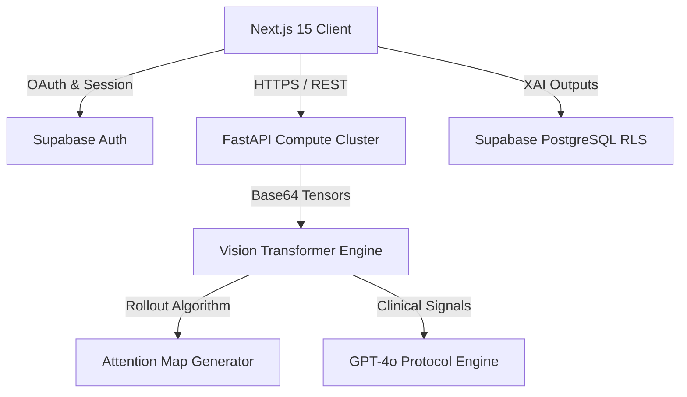

<div align="center">

# 🧠 AlzDetect: Next-Generation Neurological Diagnostics
**An Enterprise-Grade Vision Transformer (ViT) Architecture for Early Alzheimer's Detection**

[](https://nextjs.org/)
[](https://fastapi.tiangolo.com/)
[](https://reactjs.org/)
[](https://www.tensorflow.org/)
[](https://supabase.com/)

[**View Live Deployment**](https://dissertation-7btvsdelz-bassey-rimans-projects.vercel.app/) • [**Technical Documentation**](#architecture) • [**Clinical Protocol**](#clinical-validation)

</div>

---

## 📖 Executive Summary

**AlzDetect** is a production-ready medical technology platform engineered to assist neurologists in the early-stage detection of Alzheimer's disease. Moving beyond conventional diagnostics, the platform leverages state-of-the-art **Vision Transformers (ViT-B/32)** to extract granular, high-dimensional features from patient MRI sequences. 

Designed with enterprise architecture in mind, the system integrates a mathematically rigorous **Explainable AI (XAI)** engine, real-time clinical protocol generation via LLMs, and stringent HIPAA-aligned data security protocols utilizing Supabase Row Level Security (RLS) and End-to-End Encryption methodologies.

---

## 🏗️ System Architecture

The application is structured as a decoupled microservices environment, ensuring strict separation of concerns, massive horizontal scalability, and adherence to medical data handling standards.



### Core Tiers:
1. **The Presentation Layer (Client)**: Engineered with Next.js 15 (React 18), featuring a custom glassmorphic UI system, fluid hardware-accelerated animations, and responsive clinical drill-down views.
2. **The Compute Layer (Backend)**: A high-concurrency Python ASGI server (FastAPI) deployed via Uvicorn. Handles heavy tensor matrix transformations and AI inference routing.
3. **The Intelligence Layer (Model)**: A dynamically loaded Vision Transformer employing a custom manual-rollout script to bypass Keras 3 schema restrictions, enabling pixel-perfect Attention Map visualizations.
4. **The Persistence Layer (Database)**: Supabase (PostgreSQL) handling robust authentication, user-scoped data segregation via RLS, and blob storage for diagnostic visual histories.

---

## 🔬 Explainable AI & Clinical Validation

A core tenet of modern medical software is interpretability. The AlzDetect architecture implements a rigorous **Attention Map Rollout**. 

Instead of treating the AI as a "black box," the system manually intercepts the neural network's internal Multi-Head Self-Attention layers block-by-block. It projects these highly activated weights backward to the input space, generating a high-contrast heatmap overlay on the original MRI. This mathematically demonstrates *exactly* which anatomical regions (e.g., Hippocampus, Ventricles) the network analyzed to output its prediction.

---

## 🛡️ Enterprise Security & Compliance

- **Role-Based Access Control (RBAC)**: Enforced at the database level via Supabase.
- **Data Segregation**: PostgreSQL Row Level Security (RLS) guarantees that individual clinical sessions and diagnostic logs are completely isolated and inaccessible across accounts.
- **Stateless Inference**: The diagnostic compute cluster immediately purges MRI buffers post-inference. History is permanently archived only if the user explicitly saves the validated sequence to their secure Vault.

---

## 🚀 Local Deployment Guide

### Prerequisites
- Node.js (v18+)
- Python (v3.12, strict requirement for legacy `tf-keras` compatibility)
- pip / pnpm

### 1. The Client (Next.js)
```bash
cd client
pnpm install
# Ensure .env contains NEXT_PUBLIC_SUPABASE_URL and ANON_KEY
pnpm dev
```
Client will mount at `http://localhost:3000`

### 2. The Compute Engine (FastAPI)
```bash
cd server
python -m venv .venv_prod
source .venv_prod/Scripts/activate # Windows
pip install -r requirements.txt
# TF_USE_LEGACY_KERAS=1 is strictly required in .env
python -m uvicorn src.server:app --host 0.0.0.0 --port 8000 --reload
```
Engine will mount at `http://localhost:8000`

---

## 👤 Lead Architect

**Bassey Riman**  
*Lead Architect & AI Engineer*  
*Integrating cutting-edge machine learning into scalable, beautifully-engineered consumer health interfaces.*

<div align="center">
  <sub>Built for the future of Neurological Diagnostic Care.</sub>
</div>
